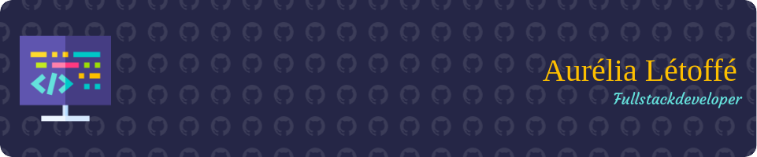

### Hello world 👋

After completing my studies in international commerce, I have amassed 16 years of professional experience, including 6 years in procurement and sales, followed by 10 years specializing in procurement, and an additional 2 years as a Business Process Outsourcing (BPO) specialist focused on the creation and deployment of a new Enterprise Resource Planning (ERP) system. Recognizing the need for career evolution, I have decided to pivot towards development. Consequently, I am currently undergoing training as a fullstack JavaScript developer at O'clock School since late October. I am seeking opportunities to further develop these new skills as an intern or junior developer.

If my profile aligns with your needs or interests, please feel free to reach out to me.

